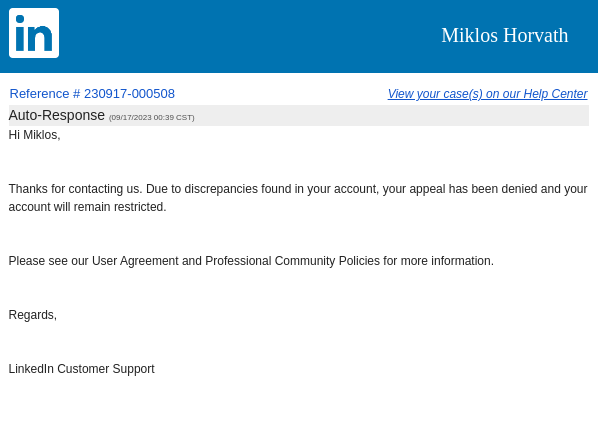

# LinkedIn

The LinkedIn simply deleted my account because as a Hungarian citizen I live abroad, currently in Nepal. They don't accept my passport, driving licence, etc. Because those are from Hungary, not from Nepal. I also could not talk with their support because I need to login for that...

I had the same bad experience with PayPal and Youtube too. It is crazy, why the american companies think everybody have citizenship from that country where they live? It is the 21st century, millions live abroad, far away from their own home countries, including USA citizens...

